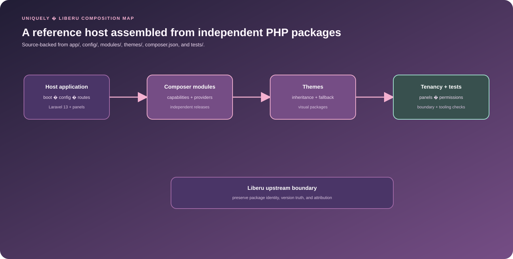

# Uniquely

<p align="center">
  
</p>

> A Liberu-based Laravel SaaS foundation for assembling capabilities, themes, and tenancy-aware application surfaces.

## Overview

Uniquely brings independently released Liberu modules, themes, contracts, and host-level configuration together in one reference application. It is designed for teams that want package-level reuse without losing visibility into bootstrapping, panel composition, environment configuration, and cross-package behavior.


## Measured evidence

Uniquely has one of the strongest conventional software-quality snapshots in this portfolio.

| Evidence | Verified snapshot / repository state | Reproduce / inspect |
| --- | ---: | --- |
| Installed Composer-style modules tracked in `/modules` | **40** | repository `modules/` tree |
| Installed themes tracked in `/themes` | **4** | `base`, `clear-signal`, `dark`, `default` |
| Test result at audited commit `41eba178...` | **203 passed / 12 skipped / 670 assertions** | workflow run 37183653563 |
| Composer metadata validation | passed before test execution | `.github/workflows/tests.yml` |
| Dependency audit | passed before test execution | `composer audit --locked` |
| Pint | passed before test execution | workflow test lane |
| PHPStan | passed before test execution | workflow test lane |
| Test coverage gate | application host lane requires **99% minimum** | `php artisan test --coverage-clover=coverage.xml --min=99` |
| Install workflow at audited commit | **successful** | workflow run 37183653444 |
| Overall Tests workflow conclusion | **failed after tests** because Codecov rejected the tokenless upload | workflow run 37183653563 |
| Docker workflow at audited commit | **failed** after a GitHub API rate-limit issue | workflow run 37183653487 |

This is a **dated evidence snapshot from 4 October 2026**, not a claim about the moving `main` branch. The current branch has advanced since commit `41eba178...`; rerun CI before quoting these numbers as current release status.

## What is new

Uniquely's technical signature is **composition as a first-class runtime concern**: modules, themes and host policy are versioned separately, but the application validates how they fit together before treating the composition as usable.

```text
Composer package graph
        ↓
Tracked modules + themes
        ↓
Module metadata / dependencies
        ↓
Dependency + cycle validation
        ↓
Theme compatibility / inheritance / fallback
        ↓
Host panels + routes + application behavior
```

Distinctive engineering choices:

- **Package ownership remains visible** — installed modules and themes are tracked rather than hidden entirely under `vendor/`.
- **Installation and enablement are separate** — a package can exist in the application without automatically becoming active capability.
- **Dependency order is explicit** — module metadata drives dependency validation and provider ordering.
- **Theme variation is bounded** — compatibility, inheritance and fallback rules prevent a visual package from silently replacing application architecture.
- **Cross-package behavior is tested at the host level** while reusable modules retain their own package boundaries.

The project is strongest as a **modular Laravel composition reference**, not as an AI-system benchmark.

[Software](https://liberusoftware.com) · [Hosting](https://liberuhosting.com) · [Services](https://liberuservices.com) · [Liberu Group](https://liberugroup.com)

[](https://www.php.net/) [](https://laravel.com/) [](https://filamentphp.com/) [](https://livewire.laravel.com/)

[](LICENSE.md)

## Verified capabilities

| Capability | Implementation evidence |
|---|---|
| Module dependency and cycle validation | `config/modules.php`, `modules/*/module.json`, and the host ModuleRegistry validate declared dependencies, provider order, and cycles before boot. |
| Theme compatibility and fallback | `themes/*/theme.json` metadata and the ThemeManager handle compatibility checks, inheritance, and safe fallback behavior. |
| Host-level integration | `app/`, `config/`, and `routes/` contain the application shell, enabled package graph, panel/runtime policy, and integration points. |
| Cross-package engineering evidence | `tests/`, `.claude/skills/`, and `AGENTS.md` support architecture checks, coverage, static analysis, and development workflows. |

Uniquely is strongest as a composition and developer-experience asset: it shows how a Laravel product family can share capabilities while retaining package ownership, release boundaries, and a visible application host.

## Key features

- Jetstream authentication, profiles, sessions, two-factor authentication, passkeys, and social login
- Filament admin and account panels assembled from optional presentation modules
- Organisations, teams, roles, permissions, audit trails, settings, and feature flags
- Messaging, notifications, localisation, search, files, webhooks, integrations, analytics, and import/export foundations
- Queue, scheduler, Horizon, Pulse, Telescope, Octane, Reverb, backup, and observability support
- Independently versioned modules installed into tracked `/modules` directories
- Independently versioned themes installed into tracked `/themes` directories with inheritance and safe fallback
- Architecture tests for manifests, dependency direction, package ownership, and presentation boundaries
- ModuleRegistry dependency and cycle validation before provider boot
- ThemeManager compatibility checks, inheritance resolution, and safe fallback behavior


## Code map and evidence

| Concern | Location | Evidence in this repository |
|---|---|---|
| Host composition | `app/`, `config/`, `routes/` | application bootstrapping, enabled module graph and panel/runtime configuration |
| Module registry | `config/modules.php`, `modules/*/module.json` | ModuleRegistry dependency/cycle validation and provider ordering |
| Theme manager | `themes/*/theme.json`, `themes/*/` | ThemeManager compatibility, inheritance and fallback behavior |
| Reusable capabilities | `modules/*/` | tracked Composer modules with `composer.json`, `module.json`, README files and package tests |
| Themes and fallback | `themes/*/` | tracked theme packages, compatibility metadata and asset tests |
| Cross-package behaviour | `tests/` | architecture, module discovery, auth, tenancy, search, settings, theme and operational feature coverage |
| Tooling | `.claude/skills/`, `AGENTS.md` | coverage/static-analysis guidance and project-specific development workflows |

**Verification snapshot (2026-10-04).** At audited commit [`41eba178036ae3cad36255c69a07ca2d3b7312ed`](https://github.com/Masterleeaus/Uniquely/commit/41eba178036ae3cad36255c69a07ca2d3b7312ed), Composer metadata validation, dependency installation, `composer audit --locked`, Pint, PHPStan, and the application test run completed successfully with **203 passed, 12 skipped, 670 assertions**. The enclosing [Tests workflow run 37183653563](https://github.com/Masterleeaus/Uniquely/actions/runs/37183653563) still concluded **failure** because the later Codecov upload was rejected without a valid token. The separate Docker workflow also failed after a GitHub API rate-limit issue. Treat these as dated, component-level results rather than an all-green CI claim.

## Requirements

| Dependency | Supported version |
|---|---|
| PHP | 8.5 |
| Laravel | 13.x |
| Filament | 5.x |
| Livewire | 4.x |
| Composer | 2.x |
| Node.js | Latest stable release |
| Database | A Laravel-supported SQL database |

## Quick start

```bash
git clone https://github.com/Masterleeaus/Uniquely.git
cd Uniquely
composer install
cp .env.example .env
php artisan key:generate
npm install
npm run build
php artisan migrate
php artisan serve
```

Review `.env` before migrating. Use `php artisan migrate --seed` only when example data is wanted. The optional interactive `install.sh` supports local, Docker, and Kubernetes-oriented setup.

## Composable package architecture

Each runtime capability is an independent `liberu-module` Composer package with its own GitHub repository, release lifecycle, manifest, provider, documentation, and tests. Each visual package is an independent `liberu-theme`. Shared contract packages and the custom installer are normal Composer dependencies under `/vendor`.

```text
Application composition
├── modules/       # Composer-installed module releases, tracked in Git
├── themes/        # Composer-installed theme releases, tracked in Git
├── app/           # Host-only composition and integration
├── config/        # Enabled modules and application policy
└── tests/         # Cross-package and application tests
```

Composer is the source of installation and version truth:

```bash
# Update all dependencies, including modules and themes
composer update --with-all-dependencies

# Update one capability from its tagged GitHub repository
composer update liberusoftware/search --with-dependencies
```

The trusted [`liberusoftware/composer-installer`](https://github.com/liberusoftware/composer-installer) places packages according to type:

| Composer type | Install path | Repository convention |
|---|---|---|
| `liberu-module` | `/modules/{installer-name}` | `liberusoftware/module-{installer-name}` |
| `liberu-theme` | `/themes/{installer-name}` | `liberusoftware/theme-{installer-name}` |
| Contract/library | `/vendor` | Package-specific repository |

`modules/` and `themes/` are intentionally kept out of `.gitignore`. Their reproduced contents are committed so deployments and reviews can see the exact installed code, while `composer.lock` pins each release and source commit. Do not edit an installed module only in this host: contribute the generic change to its package repository, release it, and update the Composer dependency here.

Installation, runtime enablement, authorisation, and commercial entitlement are separate concerns. `config/modules.php` selects the enabled capability graph; the ModuleRegistry validates dependencies, rejects cycles, and orders providers without scanning application classes manually.

Every module also publishes a validated feature catalog in `module.json`. Hosts can inspect the complete catalog or search it without loading module internals:

```bash
php artisan module:features
php artisan module:features health
php artisan module:status search
```

## Module and theme development

A module owns one cohesive capability and communicates through public contracts, actions, events, registries, or stable identifiers. Domain modules do not depend on Filament or themes; optional `*-filament`, `*-api`, and `*-livewire` packages provide presentation adapters.

Every module contains:

```text
composer.json
module.json
README.md
LICENSE.md
CHANGELOG.md
src/
database/ or resources/ when required
tests/
```

Themes contain `composer.json`, `theme.json`, source assets, compatibility metadata, accessibility/fallback expectations, tests, documentation, and asset licensing information. The ThemeManager applies compatibility, inheritance, and fallback rules when the host selects a theme. See the [module development guide](docs/MODULE_DEVELOPMENT.md) and [theme architecture](docs/THEME_ARCHITECTURE.md).

## Testing and quality

```bash
composer validate --strict
vendor/bin/pest
vendor/bin/pint --test
npm run build
```

The test suite exercises application behaviour and every installed module provider. Package architecture tests verify metadata, declared dependencies, host isolation, UI boundaries, and Composer ownership.

### Packagist registration

The repository includes `scripts/submit-packagist.php` for verified package-to-repository mapping and optional Packagist registration.

After the repositories are public, register every Composer package on Packagist:

```bash
# Verify all package-to-repository mappings without submitting
php scripts/submit-packagist.php --dry-run

# Obtain the MAIN API token from packagist.org/profile, then bulk register the packages
export PACKAGIST_USERNAME='your-packagist-username'
export PACKAGIST_API_TOKEN='your-packagist-api-token'
php scripts/submit-packagist.php
unset PACKAGIST_API_TOKEN
```

The submitter skips packages that are already registered and reports individual
API failures without printing the configured token.

## Documentation

- [Module development](docs/MODULE_DEVELOPMENT.md)
- [Foundation compliance](docs/FOUNDATION_COMPLIANCE.md)
- [Foundation module matrix](docs/FOUNDATION_MODULE_MATRIX.md)
- [Theme architecture](docs/THEME_ARCHITECTURE.md)
- [Theme system](docs/THEME_SYSTEM.md)
- [Messaging architecture](docs/MESSAGING_ARCHITECTURE.md)
- [Search architecture](docs/SEARCH_ARCHITECTURE.md)
- [Localisation](docs/MULTI_LANGUAGE.md)
- [Notifications](docs/NOTIFICATIONS.md)

## Related Liberu projects

| Project | Repository | Scope |
|---|---|---|
| Accounting | [liberusoftware/accounting-erp-laravel](https://github.com/liberusoftware/accounting-erp-laravel) | Ledgers, banking, tax, expenses, close, and reporting |
| Automation | [liberusoftware/automation-laravel](https://github.com/liberusoftware/automation-laravel) | Governed workflows, provider-neutral AI, approvals, and connectors |
| Billing | [liberusoftware/billing-laravel](https://github.com/liberusoftware/billing-laravel) | Billing, subscriptions, payments, invoices, and revenue operations |
| Boilerplate | [liberusoftware/boilerplate-laravel](https://github.com/liberusoftware/boilerplate-laravel) | Modular Laravel foundation and reference implementation |
| Browser game | [liberusoftware/browser-game-laravel](https://github.com/liberusoftware/browser-game-laravel) | Browser-based game platform and domain capabilities |
| CMS | [liberusoftware/cms-laravel](https://github.com/liberusoftware/cms-laravel) | Content, publishing, pages, media, search, and delivery |
| Control panel | [liberusoftware/control-panel-laravel](https://github.com/liberusoftware/control-panel-laravel) | Hosting, infrastructure, DNS, mail, backups, and operations |
| CRM | [liberusoftware/crm-laravel](https://github.com/liberusoftware/crm-laravel) | Customers, leads, opportunities, sales, and service |
| Ecommerce | [liberusoftware/ecommerce-laravel](https://github.com/liberusoftware/ecommerce-laravel) | Catalogues, checkout, orders, fulfilment, and returns |
| Genealogy | [liberusoftware/genealogy-laravel](https://github.com/liberusoftware/genealogy-laravel) | Genealogy records, relationships, sources, and research |
| Maintenance | [liberusoftware/maintenance-laravel](https://github.com/liberusoftware/maintenance-laravel) | Maintenance planning, assets, work orders, and operations |
| Real estate | [liberusoftware/real-estate-laravel](https://github.com/liberusoftware/real-estate-laravel) | Property, listing, tenancy, and transaction workflows |
| Social network | [liberusoftware/social-network-laravel](https://github.com/liberusoftware/social-network-laravel) | Social profiles, groups, content, messaging, and discovery |

## Security

Do not report security vulnerabilities through public GitHub issues. Email `security@liberusoftware.com` with reproduction details and the affected version so the report can be handled privately.

## License

This project is open-source software available under the [MIT License](LICENSE.md). The linked licence text is authoritative; this summary is not legal advice.

## Feedback and contributing

Feedback and contributions are welcome. Report reproducible bugs, propose focused enhancements, improve documentation or translations, and submit tested changes. Search existing issues first. Pull requests should explain the problem and approach, remain focused, pass the required checks, and document user-visible or breaking changes. Security reports must follow the private route above.

## Contributors

Thank you to everyone who helps improve Liberu. [View the contributors graph](https://github.com/liberusoftware/boilerplate-laravel/graphs/contributors).
